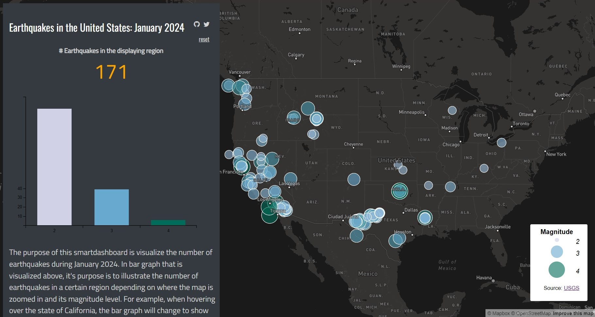

# Lab6 Smart Dashboard

## Introduction
In this smart dashboard, I decided to focus on earthquakes that occurred during the month of January 2024, in the United States. I figured that it would be interesting to visualize these earthquakes and analyze them for any patterns that might have occurred.

[Map link here](https://elilsan.github.io/Lab6Dashboard/map.html)

While analyzing the results of the visualization, it was worth nothing that many of the earthquakes occurred on the west side of the United States. More specifically, in the state of California, perhaps due to the many fault lines that slice through the state. One of those being The San Andreas fault, which is the longest fault line in the state.
This smart dashboard is useful for those who are curious to see how many earthquakes occurred in the United States and where they were located. It allows the user to zoom in and out, and see the distribution of the magnitudes as well. 
